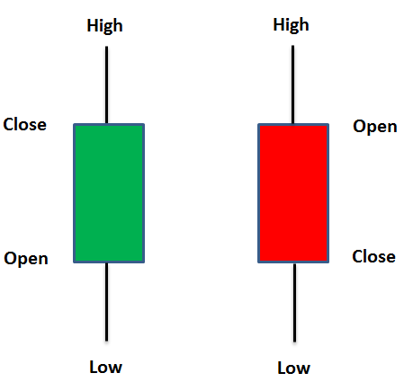

# Stock Market Tools

##### Required Libraries -
1) Numpy
2) matplotlib
3) pandas
4) pandas-datareader
5) tensorflow
6) scikit-learn
7) mpl-finance 

This repository currently contains 2 programs -
1) To plot a candlestick graph
2) To predict the closing stock price of a company

## Candlestick Graphs

This program plots the OHLC( Open, High, Low, Close) values for the given company from January of 2021

I have used the Yahoo API to fetch the data and if you want to display the data of any other company, please follow the following steps- 
-> Go to finance.yahoo.com  
-> Type out the name of the company you want to display the graph for  
-> Copy the ticker symbol and replace the ticker symbol on line 14  

## Stock Price predictor

### This model is not a 100% accurate and you must never rely on this model for investing.

This program uses Long short-term memory (LSTM) which is an artificial recurrent neural network.
We give this program the stock price of a particular company and it predicts the stock price of the company.
It also draws a graph which shows the actual stock price and the predicted stock price. 
To change the company follow the first two steps of the candlestick graphs program and then replace the ticker symbol on Line 12
